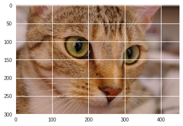

## Choosing a plotting backend

### Inline plots


```python
import numpy as np
import matplotlib.pyplot as plt
```


    ---------------------------------------------------------------------------

    ModuleNotFoundError                       Traceback (most recent call last)

    <ipython-input-4-4f2338257c9d> in <module>()
          1 import numpy as np
    ----> 2 import matplotlib.pyplot as plt
    

    /home/jeong/anaconda3/lib/python3.6/site-packages/matplotlib/pyplot.py in <module>()
        113 
        114 from matplotlib.backends import pylab_setup
    --> 115 _backend_mod, new_figure_manager, draw_if_interactive, _show = pylab_setup()
        116 
        117 _IP_REGISTERED = None


    /home/jeong/anaconda3/lib/python3.6/site-packages/matplotlib/backends/__init__.py in pylab_setup()
         30     # imports. 0 means only perform absolute imports.
         31     backend_mod = __import__(backend_name,
    ---> 32                              globals(),locals(),[backend_name],0)
         33 
         34     # Things we pull in from all backends


    /home/jeong/anaconda3/lib/python3.6/site-packages/matplotlib/backends/backend_qt4agg.py in <module>()
         16 
         17 
    ---> 18 from .backend_qt5agg import FigureCanvasQTAggBase as _FigureCanvasQTAggBase
         19 
         20 from .backend_agg import FigureCanvasAgg


    /home/jeong/anaconda3/lib/python3.6/site-packages/matplotlib/backends/backend_qt5agg.py in <module>()
         14 
         15 from .backend_agg import FigureCanvasAgg
    ---> 16 from .backend_qt5 import QtCore
         17 from .backend_qt5 import QtGui
         18 from .backend_qt5 import FigureManagerQT


    /home/jeong/anaconda3/lib/python3.6/site-packages/matplotlib/backends/backend_qt5.py in <module>()
         24 
         25 from matplotlib.widgets import SubplotTool
    ---> 26 import matplotlib.backends.qt_editor.figureoptions as figureoptions
         27 
         28 from .qt_compat import (QtCore, QtGui, QtWidgets, _getSaveFileName,


    /home/jeong/anaconda3/lib/python3.6/site-packages/matplotlib/backends/qt_editor/figureoptions.py in <module>()
         18 import matplotlib
         19 from matplotlib import cm, markers, colors as mcolors
    ---> 20 import matplotlib.backends.qt_editor.formlayout as formlayout
         21 from matplotlib.backends.qt_compat import QtGui
         22 


    /home/jeong/anaconda3/lib/python3.6/site-packages/matplotlib/backends/qt_editor/formlayout.py in <module>()
         54 
         55 from matplotlib import colors as mcolors
    ---> 56 from matplotlib.backends.qt_compat import QtGui, QtWidgets, QtCore
         57 
         58 


    /home/jeong/anaconda3/lib/python3.6/site-packages/matplotlib/backends/qt_compat.py in <module>()
        135     # have been changed in the above if block
        136     if QT_API in [QT_API_PYQT, QT_API_PYQTv2]:  # PyQt4 API
    --> 137         from PyQt4 import QtCore, QtGui
        138 
        139         try:


    ModuleNotFoundError: No module named 'PyQt4'


```python
%matplotlib inline
```


```python
plt.imshow(np.random.rand(10, 10), interpolation='none')
```


    <matplotlib.image.AxesImage at 0x7ff201973080>





### Exported figures

### GUI toolkits


```python
%matplotlib qt
plt.imshow(np.random.rand(10, 10), interpolation='none')
```


    ---------------------------------------------------------------------------

    ModuleNotFoundError                       Traceback (most recent call last)

    <ipython-input-3-ef4b06178a03> in <module>()
    ----> 1 get_ipython().magic('matplotlib qt')
          2 plt.imshow(np.random.rand(10, 10), interpolation='none')


    /home/jeong/anaconda3/lib/python3.6/site-packages/IPython/core/interactiveshell.py in magic(self, arg_s)
       2156         magic_name, _, magic_arg_s = arg_s.partition(' ')
       2157         magic_name = magic_name.lstrip(prefilter.ESC_MAGIC)
    -> 2158         return self.run_line_magic(magic_name, magic_arg_s)
       2159 
       2160     #-------------------------------------------------------------------------


    /home/jeong/anaconda3/lib/python3.6/site-packages/IPython/core/interactiveshell.py in run_line_magic(self, magic_name, line)
       2077                 kwargs['local_ns'] = sys._getframe(stack_depth).f_locals
       2078             with self.builtin_trap:
    -> 2079                 result = fn(*args,**kwargs)
       2080             return result
       2081 


    <decorator-gen-104> in matplotlib(self, line)


    /home/jeong/anaconda3/lib/python3.6/site-packages/IPython/core/magic.py in <lambda>(f, *a, **k)
        186     # but it's overkill for just that one bit of state.
        187     def magic_deco(arg):
    --> 188         call = lambda f, *a, **k: f(*a, **k)
        189 
        190         if callable(arg):


    /home/jeong/anaconda3/lib/python3.6/site-packages/IPython/core/magics/pylab.py in matplotlib(self, line)
         98             print("Available matplotlib backends: %s" % backends_list)
         99         else:
    --> 100             gui, backend = self.shell.enable_matplotlib(args.gui)
        101             self._show_matplotlib_backend(args.gui, backend)
        102 


    /home/jeong/anaconda3/lib/python3.6/site-packages/IPython/core/interactiveshell.py in enable_matplotlib(self, gui)
       2945                 gui, backend = pt.find_gui_and_backend(self.pylab_gui_select)
       2946 
    -> 2947         pt.activate_matplotlib(backend)
       2948         pt.configure_inline_support(self, backend)
       2949 


    /home/jeong/anaconda3/lib/python3.6/site-packages/IPython/core/pylabtools.py in activate_matplotlib(backend)
        293 
        294     import matplotlib.pyplot
    --> 295     matplotlib.pyplot.switch_backend(backend)
        296 
        297     # This must be imported last in the matplotlib series, after


    /home/jeong/anaconda3/lib/python3.6/site-packages/matplotlib/pyplot.py in switch_backend(newbackend)
        231     matplotlib.use(newbackend, warn=False, force=True)
        232     from matplotlib.backends import pylab_setup
    --> 233     _backend_mod, new_figure_manager, draw_if_interactive, _show = pylab_setup()
        234 
        235 


    /home/jeong/anaconda3/lib/python3.6/site-packages/matplotlib/backends/__init__.py in pylab_setup()
         30     # imports. 0 means only perform absolute imports.
         31     backend_mod = __import__(backend_name,
    ---> 32                              globals(),locals(),[backend_name],0)
         33 
         34     # Things we pull in from all backends


    /home/jeong/anaconda3/lib/python3.6/site-packages/matplotlib/backends/backend_qt4agg.py in <module>()
         16 
         17 
    ---> 18 from .backend_qt5agg import FigureCanvasQTAggBase as _FigureCanvasQTAggBase
         19 
         20 from .backend_agg import FigureCanvasAgg


    /home/jeong/anaconda3/lib/python3.6/site-packages/matplotlib/backends/backend_qt5agg.py in <module>()
         14 
         15 from .backend_agg import FigureCanvasAgg
    ---> 16 from .backend_qt5 import QtCore
         17 from .backend_qt5 import QtGui
         18 from .backend_qt5 import FigureManagerQT


    /home/jeong/anaconda3/lib/python3.6/site-packages/matplotlib/backends/backend_qt5.py in <module>()
         24 
         25 from matplotlib.widgets import SubplotTool
    ---> 26 import matplotlib.backends.qt_editor.figureoptions as figureoptions
         27 
         28 from .qt_compat import (QtCore, QtGui, QtWidgets, _getSaveFileName,


    /home/jeong/anaconda3/lib/python3.6/site-packages/matplotlib/backends/qt_editor/figureoptions.py in <module>()
         18 import matplotlib
         19 from matplotlib import cm, markers, colors as mcolors
    ---> 20 import matplotlib.backends.qt_editor.formlayout as formlayout
         21 from matplotlib.backends.qt_compat import QtGui
         22 


    /home/jeong/anaconda3/lib/python3.6/site-packages/matplotlib/backends/qt_editor/formlayout.py in <module>()
         54 
         55 from matplotlib import colors as mcolors
    ---> 56 from matplotlib.backends.qt_compat import QtGui, QtWidgets, QtCore
         57 
         58 


    /home/jeong/anaconda3/lib/python3.6/site-packages/matplotlib/backends/qt_compat.py in <module>()
        135     # have been changed in the above if block
        136     if QT_API in [QT_API_PYQT, QT_API_PYQTv2]:  # PyQt4 API
    --> 137         from PyQt4 import QtCore, QtGui
        138 
        139         try:


    ModuleNotFoundError: No module named 'PyQt4'


### Dynamic inline plots


```python
import matplotlib
matplotlib.use('nbagg')
```


```python
plt.imshow(np.random.rand(10, 10), interpolation='none')
plt.show()
```


    <IPython.core.display.Javascript object>


<img src="data:image/png;base64,iVBORw0KGgoAAAANSUhEUgAAAoAAAAHgCAYAAAA10dzkAAAd1UlEQVR4nO3df6zvh3zH8VcrUYaz7A9mu1VutTWUYlqdRHXUrzAqKe00qgQjOpkfo71jq7Fq6W3NjGzTYMRiIiFILLPlboRVt5lI/MrQ5qrfDTdiOszZH99z09PT++P0zO77/b3vxyN55d77vd9P8/HJvZ/7vN97vl8JAAAAAAAAAAAAAAAAAAAAAAAAAAAAAAAAAAAAAAAAAAAAAAAAAAAAAAAAAAAAAAAAAAAAAAAAAAAAAAAAAAAAAAAAAAAAAAAAAAAAAAAAAAAAAAAAAAAAAAAAAAAAAAAAAAAAAAAAAAAAAAAAAAAAAAAAAAAAAAAAAAAAAAAAAAAAAAAAAAAAAAAAAAAAQJIjkmxLsmJmZku7bVnczwE2ZVuSVTMzW/ptC8AmrSRZ3b179+qePXvMzGzJtnv37r0BuFL85wmwRFaSrO7Zs2cVgOWzZ88eAQjcagIQYIkJQGArBCDAEhOAwFYIQIAlJgCBrRCAAEtMAAJbIQABlpgABLZCAAIsMQEIbIUABFhiAhDYCgEIsMQEILAVAhBgiQlAYCsEIMASE4DAVqwkWT36TRevnvrU17faeVc/s93u/s5LWu3EF13Rbse/91Wt9pj77mi3v/7SQ1rt18/f2Wq/9c8vaLfOBCCwFQJQAApAAdhq1bEnAIEJBKAAFIACsNWqY08AAhMIQAEoAAVgq1XHngAEJhCAAlAACsBWq449AQhMIAAFoAAUgK1WHXsCEJhAAApAASgAW6069gQgMIEAFIACUAC2WnXsCUBgAgEoAAWgAGy16tgTgMAEAlAACkAB2GrVsScAgQkEoAAUgAKw1apjTwACEwhAASgABWCrVceeAAQmEIACUAAKwFarjj0BCEwgAAWgABSArVYdewIQWBYvSHJtkhuTXJ3klFtxrAAUgAJQALZadewJQGAZnJ3kv5M8M8l9kvxlku8lucsmjxeAAlAACsBWq449AQgsg6uTvGndj49Mcn2SCzd5vAAUgAJQALZadewJQKC72yb5aZIzNzz+jiQf2OR/QwAKQAEoAFutOvYEINDdr2bxm/43Njz+uixeGdyXo7K4SezdtghAASgABWCjVceeAAS620oAXrx2zM0mAAWgABSAXVYdewIQ6G4r/wTsFUABKAAFoAAUgMCSuzrJn6378ZFJvhZvAhGAAlAACkABCBy2zs7i8/+ekeTeSf4ii4+B+eVNHi8ABaAAFICtVh17AhBYFhckuS6LzwO8OslDbsWxAlAACkAB2GrVsScAgQkEoAAUgAKw1apjTwACEwhAASgABWCrVceeAAQmEIACUAAKwFarjj0BCEwgAAWgABSArVYdewIQmEAACkABKABbrTr2BCAwgQAUgAJQALZadewJQGACASgABaAAbLXq2BOAwAQCUAAKQAHYatWxJwCBCQSgABSAArDVqmNPAAITCEABKAAFYKtVx54ABCYQgAJQAArAVquOPQEITCAABaAAFICtVh17AhCYYCXJ6iN+4ZzVB314R6v927V3a7fHbn9xq53wqiva7c8///BWO/Z1O9ut+i8yG1f9l4aNqw7Qfa0zAQhshQAUgAJQALZadewJQGACASgABaAAbLXq2BOAwAQCUAAKQAHYatWxJwCBCQSgABSAArDVqmNPAAITCEABKAAFYKtVx54ABCYQgAJQAArAVquOPQEITCAABaAAFICtVh17AhCYQAAKQAEoAFutOvYEIDCBABSAAlAAtlp17AlAYAIBKAAFoABsterYE4DABAJQAApAAdhq1bEnAIEJBKAAFIACsNWqY08AAhMIQAEoAAVgq1XHngAEJhCAAlAACsBWq449AQhMIAAFoAAUgK1WHXsCEJhAAApAASgAW6069gQgMIEAFIACUAC2WnXsCUBgAgEoAAWgAGy16tgTgMAEAlAACkAB2GrVsScAgQkEoAAUgAKw1apjTwACEwhAASgABWCrVceeAAQmEIACUAAKwFarjj0BCEwgAAWgABSArVYdewIQmEAACkABKABbrTr2BCAwgQAUgAJQALZadewJQGACASgABaAAbLXq2BOAwAQCUAAKQAHYatWxJwCBCQSgABSAArDVqmNPAAITCEABKAAFYKtVx54ABCYQgAJQAArAVquOPQEITCAABaAAFICtVh17AhCYQAAKQAEoAFutOvYEIDCBABSAAlAAtlp17AlAYAIBKAAFoABsterYE4DABAJQAApAAdhq1bEnAIEJBKAAFIACsNWqY08AAhOsJFk95YmvXj3jIa9qtbd84bR2+9S1x7Ta9isub7fTHndZqz37mqe321d337XVTv27l7Xao1ee2W6dCUBgKwSgABSAArDVqmNPAAITCEABKAAFYKtVx54ABCYQgAJQAArAVquOPQEITCAABaAAFICtVh17AhCYQAAKQAEoAFutOvYEIDCBABSAAlAAtlp17AlAYAIBKAAFoABsterYE4DABAJQAApAAdhq1bEnAIEJBKAAFIACsNWqY08AAhMIQAEoAAVgq1XHngAEJhCAAlAACsBWq449AQhMIAAFoAAUgK1WHXsCEJhAAApAASgAW6069gQgsAwuSnJNkh8k+XaS9ye51604XgAKQAEoAFutOvYEILAMPpLk/CT3TXJSkg8nuS7JHTZ5vAAUgAJQALZadewJQGAZ3TmLG8Fpm3y+ABSAAlAAtlp17AlAYBkdl8WN4MT9/PxRWdwk9m5bBKAAFIACsNGqY08AAsvmyCQfSvLxAzzn4ixuFDebABSAAlAAdll17AlAYNm8Jcm1SY4+wHO8AigABaAAFIACEDhMvCnJ7iTbb+VxvgZQAApAAdhq1bEnAIFlcEQW8Xd9kuO3cLwAFIACUAC2WnXsCUBgGbw5yfeTPDzJXdft9ps8XgAKQAEoAFutOvYEILAMbvGGjrWdv8njBaAAFIACsNWqY08AAhMIQAEoAAVgq1XHngAEJhCAAlAACsBWq449AQhMIAAFoAAUgK1WHXsCEJhAAApAASgAW6069gQgMIEAFIACUAC2WnXsCUBgAgEoAAWgAGy16tgTgMAEAlAACkAB2GrVsScAgQkEoAAUgAKw1apjTwACEwhAASgABWCrVceeAAQmEIACUAAKwFarjj0BCEwgAAWgABSArVYdewIQmEAACkABKABbrTr2BCAwwUqS1eN+/5LVY1+3s9cu67f3/ecDWu0xd/6ddnvgs3e22lVffGi7Vf863rgff/3YVjv17MvbrTMBCGyFABSAAlAAtlp17AlAYAIBKAAFoABsterYE4DABAJQAApAAdhq1bEnAIEJBKAAFIACsNWqY08AAhMIQAEoAAVgq1XHngAEJhCAAlAACsBWq449AQhMIAAFoAAUgK1WHXsCEJhAAApAASgAW6069gQgMIEAFIACUAC2WnXsCUBgAgEoAAWgAGy16tgTgMAEAlAACkAB2GrVsScAgQkEoAAUgAKw1apjTwACEwhAASgABWCrVceeAAQmEIACUAAKwFarjj0BCEwgAAWgABSArVYdewIQmEAACkABKABbrTr2BCAwgQAUgAJQALZadewJQGACASgABaAAbLXq2BOAwAQCUAAKQAHYatWxJwCBCQSgABSAArDVqmNPAAITCEABKAAFYKtVx54ABCYQgAJQAArAVquOPQEITCAABaAAFICtVh17AhCYQAAKQAEoAFutOvYEIDCBABSAAlAAtlp17AlAYAIBKAAFoABsterYE4DABAJQAApAAdhq1bEnAIEJBKAAFIACsNWqY08AAhMIQAEoAAVgq1XHngAEJhCAAlAACsBWq449AQhMIAAFoAAUgK1WHXsCEJhAAApAASgAW6069gQgMIEAFIACUAC2WnXsCUBgAgEoAAWgAGy16tgTgMAEAlAACkAB2GrVsScAgQkEoAAUgAKw1apjTwACE6wkWd3+th2rjzj9T1rtMXd5frs96nbnttr/fOO4dnvweTtb7ZirLm23f/jKCa32gOftbLWTn355u3UmAIGtEIACUAAKwFarjj0BCEwgAAWgABSArVYdewIQmEAACkABKABbrTr2BCAwgQAUgAJQALZadewJQGACASgABaAAbLXq2BOAwAQCUAAKQAHYatWxJwCBCQSgABSAArDVqmNPAAITCEABKAAFYKtVx54ABCYQgAJQAArAVquOPQEITCAABaAAFICtVh17AhCYQAAKQAEoAFutOvYEIDCBABSAAlAAtlp17AlAYAIBKAAFoABsterYE4DAsrkwi5vAG27FMQJQAApAAdhq1bEnAIFlcnKSryb5TASgABSAAlAACkDgsHfHJF9KckaSXRGAAlAACkABKACBw947kly59v1dOXAAHpXFTWLvtkUACkABKAAbrTr2BCCwDM5J8tkkt1v78a4cOAAvzuJGcbMJQAEoAAVgl1XHngAEurtbkm8luf+6x3bFK4ACUAAKQAEoAIHD1plZ/Kb/6bqtJvnZ2vdvs4n/hq8BFIACUAC2WnXsCUCguzslOXHDrknyzrXvb4YAFIACUAC2WnXsCUBgGe2KdwELQAEoAAWgAARG2RUBKAAFoAAUgAIQ4AAEoAAUgAKw1apjTwACEwhAASgABWCrVceeAAQmEIACUAAKwFarjj0BCEwgAAWgABSArVYdewIQmEAACkABKABbrTr2BCAwgQAUgAJQALZadewJQGACASgABaAAbLXq2BOAwAQCUAAKQAHYatWxJwCBCQSgABSAArDVqmNPAAITCEABKAAFYKtVx54ABCYQgAJQAArAVquOPQEITCAABaAAFICtVh17AhCYYCXJ6oOf/OrVU5/6+lY77+pnttvpj3xtq51xxFntdu6/PKvVqsNhX/vB9ce02hm3ObvVqgN9X+tMAAJbIQAFoAAUgK1WHXsCEJhAAApAASgAW6069gQgMIEAFIACUAC2WnXsCUBgAgEoAAWgAGy16tgTgMAEAlAACkAB2GrVsScAgQkEoAAUgAKw1apjTwACEwhAASgABWCrVceeAAQmEIACUAAKwFarjj0BCEwgAAWgABSArVYdewIQmEAACkABKABbrTr2BCAwgQAUgAJQALZadewJQGACASgABaAAbLXq2BOAwAQCUAAKQAHYatWxJwCBCQSgABSAArDVqmNPAAITCEABKAAFYKtVx54ABCYQgAJQAArAVquOPQEITCAABaAAFICtVh17AhCYQAAKQAEoAFutOvYEIDCBABSAAlAAtlp17AlAYAIBKAAFoABsterYE4DABAJQAApAAdhq1bEnAIEJBKAAFIACsNWqY08AAhMIQAEoAAVgq1XHngAEJhCAAlAACsBWq449AQhMIAAFoAAUgK1WHXsCEJhAAApAASgAW6069gQgMIEAFIACUAC2WnXsCUBgAgEoAAWgAGy16tgTgMAEAlAACkAB2GrVsScAgQkEoAAUgAKw1apjTwACEwhAASgABWCrVceeAAQmEIACUAAKwFarjj0BCEwgAAWgABSArVYdewIQmEAACkABKABbrTr2BCAwgQAUgAJQALZadewJQGCClSSr937BJavbL9/ZatUhs689dvuLW+2EV13Rbve/oNd+79+f2m73ef8fttqpZ1/eag85p986E4DAVghAASgABWCrVceeAAQmEIACUAAKwFarjj0BCEwgAAWgABSArVYdewIQmEAACkABKABbrTr2BCAwgQAUgAJQALZadewJQGACASgABaAAbLXq2BOAwAQCUAAKQAHYatWxJwCBCQSgABSAArDVqmNPAAITCEABKAAFYKtVx54ABCYQgAJQAArAVquOPQEITCAABaAAFICtVh17AhCYQAAKQAEoAFutOvYEIDCBABSAAlAAtlp17AlAYFlsS/KuJDck+VGSzyZ58CaPFYACUAAKwFarjj0BCCyDX0pybZK3JTklyfYkj05yz00eLwAFoAAUgK1WHXsCEFgGlyb52P/heAEoAAWgAGy16tgTgMAy+FySK5O8N8m3k3w6yXNuxfECUAAKQAHYatWxJwCBZXDj2i5J8sAkz83i6wCfsZ/nH5XFTWLvtkUACkABKAAbrTr2BCCwDH6c5BMbHntjkk/u5/kXZ3GjuNkEoAAUgAKwy6pjTwACy+C6JG/d8Njzk1y/n+d7BVAACkABKAAFILDk3p1bvgnkytzyVcH98TWAAlAACsBWq449AQgsg5OT/CTJjiTHJXlakh8mOXeTxwtAASgABWCrVceeAASWxROy+PDnG5N8Pt4FLAAFoAAUgAIQ4AAEoAAUgAKw1apjTwACEwhAASgABWCrVceeAAQmEIACUAAKwFarjj0BCEwgAAWgABSArVYdewIQmEAACkABKABbrTr2BCAwgQAUgAJQALZadewJQGACASgABaAAbLXq2BOAwAQCUAAKQAHYatWxJwCBCQSgABSAArDVqmNPAAITCEABKAAFYKtVx54ABCYQgAJQAArAVquOPQEITCAABaAAFICtVh17AhCYQAAKQAEoAFutOvYEIDDBSpLVK/71oat3f+PlrVb9h9C+9sDn7Gy1Y666tN3ufeEVrXbs63e221M+8dxWO+UjL2+1Y/7qsnbrTAACWyEABaAAFICtVh17AhCYQAAKQAEoAFutOvYEIDCBABSAAlAAtlp17AlAYAIBKAAFoABsterYE4DABAJQAApAAdhq1bEnAIEJBKAAFIACsNWqY08AAhMIQAEoAAVgq1XHngAEJhCAAlAACsBWq449AQhMIAAFoAAUgK1WHXsCEJhAAApAASgAW6069gQgMIEAFIACUAC2WnXsCUBgAgEoAAWgAGy16tgTgMAEAlAACkAB2GrVsScAgQkEoAAUgAKw1apjTwACEwhAASgABWCrVceeAAQmEIACUAAKwFarjj0BCEwgAAWgABSArVYdewIQmEAACkABKABbrTr2BCAwgQAUgAJQALZadewJQGACASgABaAAbLXq2BOAwAQCUAAKQAHYatWxJwCBCQSgABSAArDVqmNPAAITCEABKAAFYKtVx54ABCYQgAJQAArAVquOPQEITCAABaAAFICtVh17AhCYQAAKQAEoAFutOvYEIDCBABSAAlAAtlp17AlAYAIBKAAFoABsterYE4DABAJQAApAAdhq1bEnAIEJBKAAFIACsNWqY08AAhMIQAEoAAVgq1XHngAEJhCAAlAACsBWq449AQhMIAAFoAAUgK1WHXsCEJhAAApAASgAW6069gQgMIEAFIACUAC2WnXsCUBggpUkq2f+/fmrZxz5lFZ70LN2ttvbvnhqq53+yNe22yMe9ppWe9jjL2u3e1x5eas9+g7ntdpjj35hu3UmAIGtEIACUAAKwFarjj0BCEwgAAWgABSArVYdewIQmEAACkABKABbrTr2BCAwgQAUgAJQALZadewJQGACASgABaAAbLXq2BOAwAQCUAAKQAHYatWxJwCBCQSgABSAArDVqmNPAAITCEABKAAFYKtVx54ABCYQgAJQAArAVquOPQEITCAABaAAFICtVh17AhCYQAAKQAEoAFutOvYEIDCBABSAAlAAtlp17AlAYAIBKAAFoABsterYE4DAMrhNklcn+WqSHyX5cpJXJjlik8cLQAEoAAVgq1XHngAElsGOJN9N8vgk90hyVpIfJHnhJo8XgAJQAArAVquOPQEILIMPJblqw2PvS/KuTR4vAAWgABSArVYdewIQWAY7klyb5IS1H5+U5FtJzt3k8QJQAApAAdhq1bEnAIFlcGSSS5P8LMlP1r696ADPPyqLm8TebYsAFIACUAA2WnXsCUBgGZyTZPfat/dL8vQkNyR5xn6ef3EWN4qbTQAKQAEoALusOvYEILAMdie5YMNjr0jyhf083yuAAlAACkABKACBJXdDkudteOyiJF/a5PG+BlAACkAB2GrVsScAgWXw9iRfy00fA/PkJN9JctkmjxeAAlAACsBWq449AQgsgzsleUOS63LTB0G/JsltN3m8ABSAAlAAtlp17AlAYAIBKAAFoABsterYE4DABAJQAApAAdhq1bEnAIEJBKAAFIACsNWqY08AAhMIQAEoAAVgq1XHngAEJhCAAlAACsBWq449AQhMIAAFoAAUgK1WHXsCEJhAAApAASgAW6069gQgMIEAFIACUAC2WnXsCUBgAgEoAAWgAGy16tgTgMAEAlAACkAB2GrVsScAgQkEoAAUgAKw1apjTwACEwhAASgABWCrVceeAAQmEIACUAAKwFarjj0BCEywkmT1jHtcsPqoB/1Rq/32J5/dbid+4JWtdtIH/6DdPnXtMa320v84q91+bccVrVb9e33j/uvrd2+3zgQgsBUCUAAKQAHYatWxJwCBCQSgABSAArDVqmNPAAITCEABKAAFYKtVx54ABCYQgAJQAArAVquOPQEITCAABaAAFICtVh17AhCYQAAKQAEoAFutOvYEIDCBABSAAlAAtlp17AlAYAIBKAAFoABsterYE4DABAJQAApAAdhq1bEnAIEJBKAAFIACsNWqY08AAhMIQAEoAAVgq1XHngAEJhCAAlAACsBWq449AQhMIAAFoAAUgK1WHXsCEJhAAApAASgAW6069gQgMIEAFIACUAC2WnXsCUBgAgEoAAWgAGy16tgTgMAEAlAACkAB2GrVsScAgQkEoAAUgAKw1apjTwACEwhAASgABWCrVceeAAQmEIACUAAKwFarjj0BCEwgAAWgABSArVYdewIQmEAACkABKABbrTr2BCAwgQAUgAJQALZadewJQGACASgABaAAbLXq2BOAwAQCUAAKQAHYatWxJwCBCQSgABSAArDVqmNPAAITrCRZPf2Y567+5kkXttpZHz2v3e79Ny9rtRPf89J2+8fPHt1qv/vxJ7Xb8S+5pNWqf69v3De/eLd227NnT9vt3r1bAAK32rYsbhxmZrbc2xaATToii5vGymG8vZF7uP/vdI1cH9eo9/4/r9G2LO7nAKxZyeKmu1J9Io25Rgfm+hyca3RwrhHAIeSme3Cu0YG5PgfnGh2cawRwCLnpHpxrdGCuz8G5RgfnGgEcQkcluXjtW/bNNTow1+fgXKODc40AAAAAAAAAAAAAAAAA4KIk1yT5QZJvJ3l/knuVnlF/F2bxERVvqD6RZrYleVeSG5L8KMlnkzy49Ix6uU2SVyf5ahbX58tJXpnZ/68UpyX5YJKvZ/F76swNP39Ekj9O8o0srtlHkxx/KE8Q4HD1kSTnJ7lvkpOSfDjJdUnuUHhOnZ2cxR/gn4kAXO+Xklyb5G1JTkmyPcmjk9yz8Jy62ZHku0ken+QeSc7K4i9eLyw8p2qPS/KaJE/OvgPw5Um+n+RJSe6f5ANJvpLkdofwHAFGuHMWN+LTqk+koTsm+VKSM5LsigBc79IkH6s+ieY+lOSqDY+9L4tXTbllAB6RxSt/L1332C8muTHJOYfwvABGOC6LG/GJ1SfS0DuSXLn2/V0RgOt9Lotr894svpTg00meU3pG/ezI4lXSE9Z+fFKSbyU5t+qEmtkYgMeuPfaADc/7pyR/eqhOCmCCI7N4leLj1SfS0DlZfE3b3n962hUBuN6Na7skyQOTPDeLr9l6RuVJNXNkFq+U/izJT9a+vaj0jHrZGIAPXXvsVzY872+TvOdQnRTABG/J4hWKo4vPo5u7ZfFKzf3XPbYrAnC9Hyf5xIbH3pjkkwXn0tU5SXavfXu/JE/P4g0zInlBAAIUeFMWfzhtrz6Rhs7M4g+in67bahav4Pw0i3d3TnddkrdueOz5Sa4vOJeudie5YMNjr0jyhYJz6cg/AQMcQkdkEX/Xx8cr7M+dsviayPW7Jsk742sl93p3bvkmkCtzy1cFJ7shyfM2PHZRFm8sYv9vAnnJusdW4k0gAD8Xb87iYxYenuSu63b7ypNaArvin4DXOzmLr2vbkcUbiZ6W5IfxBof13p7ka7npY2CenOQ7SS6rO6Vyd8ziFb4HZBGAL1r7/jFrP//yJN9L8sQs/tn8/fExMAA/F6v72fmF57QMdkUAbvSELN4oc2OSz8e7gDe6Uxa/Zq7LTR8E/Zokt608qWKnZ9/3n7ev/fzeD4L+Zha/rj6am95FDQAAAAAAAAAAAAAAAAAAAAAAAAAAAAAAAAAAAAAAAAAAAAAAAAAAAAAAAAAAAAAAAAAAAAAAAAAAAAAAAAAAAAAAAAAAAAAAAAAAAAAAAAAchv4XqvScVWOMvUEAAAAASUVORK5CYII=" width="640">


### Web-based visualization


```python
pip install mpld3
```


      File "<ipython-input-7-541091e985e0>", line 1
        pip install mpld3
                  ^
    SyntaxError: invalid syntax


```python
import numpy as np
import matplotlib.pyplot as plt
%matplotlib inline
import mpld3
mpld3.enable_notebook()
```


```python
plt.imshow(np.random.rand(10, 10), interpolation='none')
```


    <matplotlib.image.AxesImage at 0x7fb5ffb8db00>


<style>

</style>

<div id="fig_el3314140420271219712523467624"></div>
<script>
function mpld3_load_lib(url, callback){
  var s = document.createElement('script');
  s.src = url;
  s.async = true;
  s.onreadystatechange = s.onload = callback;
  s.onerror = function(){console.warn("failed to load library " + url);};
  document.getElementsByTagName("head")[0].appendChild(s);
}

if(typeof(mpld3) !== "undefined" && mpld3._mpld3IsLoaded){
   // already loaded: just create the figure
   !function(mpld3){
       
       mpld3.draw_figure("fig_el3314140420271219712523467624", {"width": 432.0, "height": 288.0, "axes": [{"bbox": [0.26083333333333336, 0.125, 0.5033333333333333, 0.755], "xlim": [-0.5, 9.5], "ylim": [9.5, -0.5], "xdomain": [-0.5, 9.5], "ydomain": [9.5, -0.5], "xscale": "linear", "yscale": "linear", "axes": [{"position": "bottom", "nticks": 7, "tickvalues": null, "tickformat": null, "scale": "linear", "fontsize": 10.0, "grid": {"gridOn": false}, "visible": true}, {"position": "left", "nticks": 7, "tickvalues": null, "tickformat": null, "scale": "linear", "fontsize": 10.0, "grid": {"gridOn": false}, "visible": true}], "axesbg": "#FFFFFF", "axesbgalpha": null, "zoomable": true, "id": "el3314140419696714360", "lines": [], "paths": [], "markers": [], "texts": [], "collections": [], "images": [{"data": "iVBORw0KGgoAAAANSUhEUgAAAAoAAAAKCAYAAACNMs+9AAAABHNCSVQICAgIfAhkiAAAAZxJREFUGJUFwU1Ik3EcwPHv/1m5asuelm0z5hPMTCVZXWR0iAcT18vBQ7BLRTQPxupipL3YugRFFL1eZNAhR7MOEQlJoHUJWjo7FATBY4flo2T4tJo+lUj56/MhsTMj0Rs3JW+1yowdFiN7XSqzEclZcWlruyrFkiHHJlKikoVuCVT95sW7GMGCh7ruKT7YETbpLkoJlUKIoa7baN+XfEydbqKm6ME/u8zimVrqw/Nca3yKfsFLz+Fn9KbSqF3P+6XT+Eh+xGTbLQt9eAWnz8Du8LHuq+AasPGToAWT06QDk2x+L5wvvmL+3FYO3X/Jv2aXhXpQ212W1yvUvoY++TOwwlBjHvPNKSxzkIOxdnrGX9NU9YMDA2dZ6whaOR5i4ckW9k6kscxB9nce5Us2zN097ZT++tHNOX4lXLTyDkVN9i11dzy03DuJ3VHNldgwpeNRLvaeINecwzfqRyWqU+I8qsXzOMCGh+OUu3azaklI9o8SWl1hxInx7VIU7XOmBWdGx41oNEx6CY7ZZC4/YOxInNY10/xMBfDOLfIfQMOc6h88OSQAAAAASUVORK5CYII=", "extent": [-0.5, 9.5, 9.5, -0.5], "coordinates": "data", "alpha": null, "zorder": 0, "id": "el3314140419656112896"}], "sharex": [], "sharey": []}], "data": {}, "id": "el3314140420271219712", "plugins": [{"type": "reset"}, {"type": "zoom", "button": true, "enabled": false}, {"type": "boxzoom", "button": true, "enabled": false}]});
   }(mpld3);
}else if(typeof define === "function" && define.amd){
   // require.js is available: use it to load d3/mpld3
   require.config({paths: {d3: "https://mpld3.github.io/js/d3.v3.min"}});
   require(["d3"], function(d3){
      window.d3 = d3;
      mpld3_load_lib("https://mpld3.github.io/js/mpld3.v0.3.js", function(){
         
         mpld3.draw_figure("fig_el3314140420271219712523467624", {"width": 432.0, "height": 288.0, "axes": [{"bbox": [0.26083333333333336, 0.125, 0.5033333333333333, 0.755], "xlim": [-0.5, 9.5], "ylim": [9.5, -0.5], "xdomain": [-0.5, 9.5], "ydomain": [9.5, -0.5], "xscale": "linear", "yscale": "linear", "axes": [{"position": "bottom", "nticks": 7, "tickvalues": null, "tickformat": null, "scale": "linear", "fontsize": 10.0, "grid": {"gridOn": false}, "visible": true}, {"position": "left", "nticks": 7, "tickvalues": null, "tickformat": null, "scale": "linear", "fontsize": 10.0, "grid": {"gridOn": false}, "visible": true}], "axesbg": "#FFFFFF", "axesbgalpha": null, "zoomable": true, "id": "el3314140419696714360", "lines": [], "paths": [], "markers": [], "texts": [], "collections": [], "images": [{"data": "iVBORw0KGgoAAAANSUhEUgAAAAoAAAAKCAYAAACNMs+9AAAABHNCSVQICAgIfAhkiAAAAZxJREFUGJUFwU1Ik3EcwPHv/1m5asuelm0z5hPMTCVZXWR0iAcT18vBQ7BLRTQPxupipL3YugRFFL1eZNAhR7MOEQlJoHUJWjo7FATBY4flo2T4tJo+lUj56/MhsTMj0Rs3JW+1yowdFiN7XSqzEclZcWlruyrFkiHHJlKikoVuCVT95sW7GMGCh7ruKT7YETbpLkoJlUKIoa7baN+XfEydbqKm6ME/u8zimVrqw/Nca3yKfsFLz+Fn9KbSqF3P+6XT+Eh+xGTbLQt9eAWnz8Du8LHuq+AasPGToAWT06QDk2x+L5wvvmL+3FYO3X/Jv2aXhXpQ212W1yvUvoY++TOwwlBjHvPNKSxzkIOxdnrGX9NU9YMDA2dZ6whaOR5i4ckW9k6kscxB9nce5Us2zN097ZT++tHNOX4lXLTyDkVN9i11dzy03DuJ3VHNldgwpeNRLvaeINecwzfqRyWqU+I8qsXzOMCGh+OUu3azaklI9o8SWl1hxInx7VIU7XOmBWdGx41oNEx6CY7ZZC4/YOxInNY10/xMBfDOLfIfQMOc6h88OSQAAAAASUVORK5CYII=", "extent": [-0.5, 9.5, 9.5, -0.5], "coordinates": "data", "alpha": null, "zorder": 0, "id": "el3314140419656112896"}], "sharex": [], "sharey": []}], "data": {}, "id": "el3314140420271219712", "plugins": [{"type": "reset"}, {"type": "zoom", "button": true, "enabled": false}, {"type": "boxzoom", "button": true, "enabled": false}]});
      });
    });
}else{
    // require.js not available: dynamically load d3 & mpld3
    mpld3_load_lib("https://mpld3.github.io/js/d3.v3.min.js", function(){
         mpld3_load_lib("https://mpld3.github.io/js/mpld3.v0.3.js", function(){
                 
                 mpld3.draw_figure("fig_el3314140420271219712523467624", {"width": 432.0, "height": 288.0, "axes": [{"bbox": [0.26083333333333336, 0.125, 0.5033333333333333, 0.755], "xlim": [-0.5, 9.5], "ylim": [9.5, -0.5], "xdomain": [-0.5, 9.5], "ydomain": [9.5, -0.5], "xscale": "linear", "yscale": "linear", "axes": [{"position": "bottom", "nticks": 7, "tickvalues": null, "tickformat": null, "scale": "linear", "fontsize": 10.0, "grid": {"gridOn": false}, "visible": true}, {"position": "left", "nticks": 7, "tickvalues": null, "tickformat": null, "scale": "linear", "fontsize": 10.0, "grid": {"gridOn": false}, "visible": true}], "axesbg": "#FFFFFF", "axesbgalpha": null, "zoomable": true, "id": "el3314140419696714360", "lines": [], "paths": [], "markers": [], "texts": [], "collections": [], "images": [{"data": "iVBORw0KGgoAAAANSUhEUgAAAAoAAAAKCAYAAACNMs+9AAAABHNCSVQICAgIfAhkiAAAAZxJREFUGJUFwU1Ik3EcwPHv/1m5asuelm0z5hPMTCVZXWR0iAcT18vBQ7BLRTQPxupipL3YugRFFL1eZNAhR7MOEQlJoHUJWjo7FATBY4flo2T4tJo+lUj56/MhsTMj0Rs3JW+1yowdFiN7XSqzEclZcWlruyrFkiHHJlKikoVuCVT95sW7GMGCh7ruKT7YETbpLkoJlUKIoa7baN+XfEydbqKm6ME/u8zimVrqw/Nca3yKfsFLz+Fn9KbSqF3P+6XT+Eh+xGTbLQt9eAWnz8Du8LHuq+AasPGToAWT06QDk2x+L5wvvmL+3FYO3X/Jv2aXhXpQ212W1yvUvoY++TOwwlBjHvPNKSxzkIOxdnrGX9NU9YMDA2dZ6whaOR5i4ckW9k6kscxB9nce5Us2zN097ZT++tHNOX4lXLTyDkVN9i11dzy03DuJ3VHNldgwpeNRLvaeINecwzfqRyWqU+I8qsXzOMCGh+OUu3azaklI9o8SWl1hxInx7VIU7XOmBWdGx41oNEx6CY7ZZC4/YOxInNY10/xMBfDOLfIfQMOc6h88OSQAAAAASUVORK5CYII=", "extent": [-0.5, 9.5, 9.5, -0.5], "coordinates": "data", "alpha": null, "zorder": 0, "id": "el3314140419656112896"}], "sharex": [], "sharey": []}], "data": {}, "id": "el3314140420271219712", "plugins": [{"type": "reset"}, {"type": "zoom", "button": true, "enabled": false}, {"type": "boxzoom", "button": true, "enabled": false}]});
            })
         });
}
</script>


```python

```
