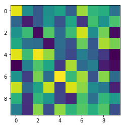
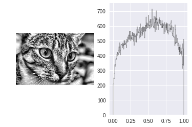

## Image processing


```python
import numpy as np
import skimage
from skimage import img_as_float
import skimage.filters as skif
from skimage.color import rgb2gray
import skimage.data as skid
import skimage.exposure as skie
from ipywidgets import interact
import matplotlib.pyplot as plt
import seaborn
%matplotlib inline
```


```python
chelsea = skid.chelsea()
```


```python
chelsea.shape, chelsea.dtype
```


    ((300, 451, 3), dtype('uint8'))


```python
plt.imshow(chelsea)
#plt.axis('off')
```


    <matplotlib.image.AxesImage at 0x7f7946620748>





```python
img = rgb2gray(chelsea)
```


```python
img.shape, img.dtype
```


    ((300, 451), dtype('float64'))


```python
img
```


    array([[ 0.48523098,  0.48523098,  0.47738784, ...,  0.11692392,
             0.11692392,  0.11692392],
           [ 0.49699569,  0.49307412,  0.48523098, ...,  0.12336824,
             0.1225349 ,  0.1272898 ],
           [ 0.50849255,  0.50457098,  0.49475569, ...,  0.12336039,
             0.12728196,  0.13120353],
           ..., 
           [ 0.24786745,  0.29884784,  0.40501294, ...,  0.58914824,
             0.58914824,  0.58914824],
           [ 0.38173647,  0.42487373,  0.39628392, ...,  0.57403529,
             0.57403529,  0.57795686],
           [ 0.42487373,  0.36883294,  0.36042431, ...,  0.55442745,
             0.55442745,  0.55834902]])


```python
chelsea
```


    array([[[143, 120, 104],
            [143, 120, 104],
            [141, 118, 102],
            ..., 
            [ 45,  27,  13],
            [ 45,  27,  13],
            [ 45,  27,  13]],
    
           [[146, 123, 107],
            [145, 122, 106],
            [143, 120, 104],
            ..., 
            [ 46,  29,  13],
            [ 45,  29,  13],
            [ 47,  30,  14]],
    
           [[148, 126, 112],
            [147, 125, 111],
            [146, 122, 109],
            ..., 
            [ 48,  28,  17],
            [ 49,  29,  18],
            [ 50,  30,  19]],
    
           ..., 
           [[ 92,  58,  30],
            [105,  71,  43],
            [132,  98,  71],
            ..., 
            [172, 145, 138],
            [172, 145, 138],
            [172, 145, 138]],
    
           [[128,  92,  60],
            [139, 103,  71],
            [134,  95,  64],
            ..., 
            [166, 142, 132],
            [166, 142, 132],
            [167, 143, 133]],
    
           [[139, 103,  71],
            [127,  88,  57],
            [125,  86,  53],
            ..., 
            [161, 137, 127],
            [161, 137, 127],
            [162, 138, 128]]], dtype=uint8)


```python
p2, p98 = np.percentile(img, (2, 98))
```


```python
img_rescale = skie.rescale_intensity(img, in_range=(p2, p98))
```


```python
img_eq = skie.equalize_hist(img)
```


```python
img_adapteq = img_as_float(skie.equalize_adapthist(img, clip_limit=0.03))
```

    /home/jeong/anaconda3/lib/python3.6/site-packages/skimage/util/dtype.py:110: UserWarning: Possible precision loss when converting from float64 to uint16
      "%s to %s" % (dtypeobj_in, dtypeobj))


```python
hist_types = dict([('Contrast stretching', img_rescale),
                   ('Histogram equalization', img_eq),
                   ('Adaptive equalization', img_adapteq)])
```


```python
@interact(hist_type=list(hist_types.keys()))
def display_result(hist_type):
    result = hist_types[hist_type]

    # We display the processed grayscale image on the left.
    plt.subplot(121)
    plt.imshow(result, cmap='gray')
    plt.axis('off')

    # We display the histogram on the right.
    plt.subplot(122)
    plt.hist(result.ravel(), bins=np.linspace(0., 1., 256),
             histtype='step', color='black')

    plt.show()
```





```python

```
